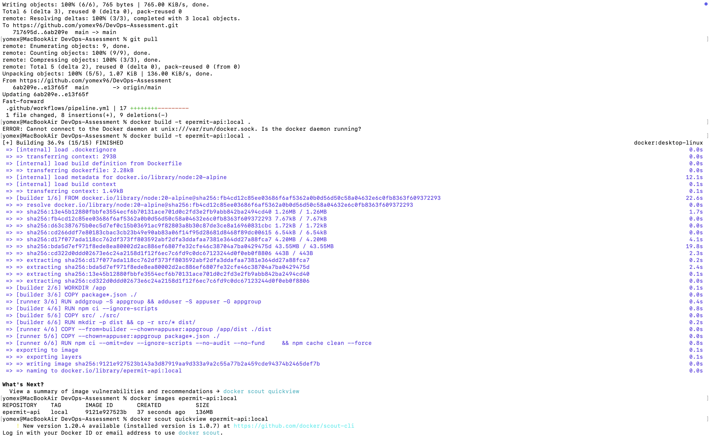
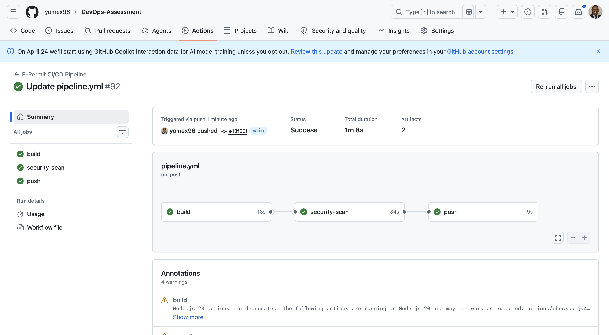

# Zero-Trust E-Permit Infrastructure

> **Qualisys Consulting DevOps Assessment — v1.0 (2026)**
> Production-grade containerisation, IaC, and CI/CD for a government E-Permit microservice.

[](https://github.com/yomex96/DevOps-Assessment/actions/workflows/pipeline.yml)

---

## Repository Structure

```
DevOps-Assessment/
├── .dockerignore                        # Prevents secrets/build artefacts from entering build context
├── .gitignore                           # Prevents state, tfvars, .env from being committed
├── .github/
│   └── workflows/
│       └── pipeline.yml                 # Task 3 — CI/CD: build → Trivy gate → simulated ECR push
├── Dockerfile                           # Task 1 — Hardened multi-stage image
├── package.json                         # Node.js app manifest (zero third-party runtime deps)
├── package-lock.json                    # Lockfile required by npm ci
├── src/
│   └── index.js                         # Minimal Node.js HTTP server with /health endpoint
├── README.md                            # Task 4 — This file
└── terraform/
    ├── providers.tf                     # terraform{} block, S3 backend, AWS provider config
    ├── main.tf                          # Root orchestrator (module calls only — no resources here)
    ├── variables.tf                     # All input variables with descriptions and validation
    ├── outputs.tf                       # Root outputs (vpc_id, subnet ids, IAM profile)
    ├── terraform.tfvars.example         # Safe, committable template — real .tfvars is gitignored
    └── modules/
        ├── vpc/                         # Task 2a — HA VPC spanning 2 AZs
        │   ├── main.tf
        │   ├── variables.tf
        │   ├── outputs.tf
        │   └── versions.tf
        └── iam/                         # Task 2b — Least-privilege EC2 IAM Role + Instance Profile
            ├── main.tf
            ├── variables.tf
            ├── outputs.tf
            └── versions.tf
```

---

## Task 1 — Dockerfile (Containerisation & Security)

### What Was Built

The original "toxic" Dockerfile was rewritten as a proper two-stage build. The key principle is that the `builder` stage does the heavy lifting — installs all dependencies and produces the distributable — and the lean `runner` stage starts clean and receives only what the application needs at runtime.

### Security and Performance Decisions

| Requirement | Implementation |
|---|---|
| Smallest possible image | Two-stage build: `builder` compiles; `runner` starts from a fresh `node:20-alpine` with only production deps |
| Non-root user | `addgroup`/`adduser` creates `appuser:appgroup`; `USER appuser` is set before `CMD` so the process never runs as root |
| Cache-optimised layers | `COPY package*.json ./` runs before `RUN npm ci` — changing `src/` does not bust the dependency cache layer |
| No lifecycle script execution | `--ignore-scripts` on both `npm ci` calls — prevents `postinstall` hooks from running arbitrary code |
| Correct file ownership | `COPY --from=builder --chown=appuser:appgroup` sets ownership in the same layer as the copy, not via a separate `RUN chown` (which would add an extra image layer) |
| Minimal CVE surface | No `curl`, no `wget`, no extra packages in the runtime image; HEALTHCHECK uses Node.js built-in `http` module |
| Graceful shutdown | `src/index.js` handles `SIGTERM` — Docker, ECS, and Kubernetes all send SIGTERM before SIGKILL |

### Key Layer Order (Cache Optimisation Explained)

```
Layer 1: FROM node:20-alpine          ← base, almost never changes
Layer 2: RUN addgroup / adduser       ← changes only if user config changes
Layer 3: COPY package*.json ./        ← only changes when deps change
Layer 4: RUN npm ci --omit=dev        ← only runs when Layer 3 changes
Layer 5: COPY dist/ ./dist/           ← changes on every code edit (correct — fast)
```

Code changes only ever rebuild from Layer 5. A full `npm ci` is never triggered by a source edit.



---

## Task 2 — Terraform Infrastructure as Code

### Architecture

```
VPC (10.0.0.0/16)
├── AZ: us-east-1a
│   ├── Public Subnet  10.0.1.0/24  ← Load Balancers
│   ├── Private Subnet 10.0.11.0/24 ← Application EC2 instances
│   └── NAT Gateway (EIP-1)         ← Outbound internet for private subnet
└── AZ: us-east-1b
    ├── Public Subnet  10.0.2.0/24  ← Load Balancers
    ├── Private Subnet 10.0.12.0/24 ← Application EC2 instances
    └── NAT Gateway (EIP-2)         ← Outbound internet for private subnet

IAM
└── Role: epermit-prod-ec2-s3-reader-role
    ├── ALLOW  s3:ListBucket   → arn:aws:s3:::epermit-secure-documents-prod
    ├── ALLOW  s3:GetObject    → arn:aws:s3:::epermit-secure-documents-prod/*
    └── DENY   s3:*            → NOT(epermit-secure-documents-prod, epermit-secure-documents-prod/*)
```

### Module Design

The code is split into two child modules (`vpc`, `iam`). The root `main.tf` is a pure orchestrator — it contains only module calls, no resource definitions. All values are variables; nothing is hardcoded.

**VPC Module design decisions:**

| Decision | Rationale |
|---|---|
| One NAT Gateway per AZ | Eliminates NAT as a single point of failure. If AZ-A's NAT fails, AZ-B's private subnet keeps routing normally |
| Per-AZ private route tables | Each private subnet routes through its own NAT — AZ failure is fully contained |
| `count = length(var.availability_zones)` | A third AZ requires only one extra CIDR in the variable list — zero code changes |

**IAM Module — Least Privilege (double lock):**

The policy applies two independent enforcement layers. Even if someone accidentally attaches a permissive AWS-managed policy to the role, the explicit Deny overrides it:

```
Request arrives → Is it in the explicit Deny? → YES → BLOCKED (Deny always wins)
                                              → NO  → Is it in the Allow? → YES → PERMITTED
                                                                           → NO  → BLOCKED (implicit deny)
```

The IAM role also has `lifecycle { prevent_destroy = true }`. For a government service, destroying the role attached to running EC2 instances must be an explicit decision — not an accidental consequence of a mis-scoped `terraform destroy`.

---

## Initialising the Terraform Code (Task 4 — Part 1)

### Step 0 — Bootstrap Prerequisites (one-time, before first `terraform init`)

The S3 backend and DynamoDB lock table must exist before Terraform can use them. Run these AWS CLI commands once:

```bash
# Create the state bucket in us-east-1
aws s3api create-bucket \
  --bucket epermit-terraform-state-prod \
  --region us-east-1

# Enable versioning — mandatory for state rollback and DR replication
aws s3api put-bucket-versioning \
  --bucket epermit-terraform-state-prod \
  --versioning-configuration Status=Enabled

# Enable server-side encryption at rest
aws s3api put-bucket-encryption \
  --bucket epermit-terraform-state-prod \
  --server-side-encryption-configuration \
  '{"Rules":[{"ApplyServerSideEncryptionByDefault":{"SSEAlgorithm":"AES256"}}]}'

# Block all public access — state files contain sensitive ARNs and resource IDs
aws s3api put-public-access-block \
  --bucket epermit-terraform-state-prod \
  --public-access-block-configuration \
  "BlockPublicAcls=true,IgnorePublicAcls=true,BlockPublicPolicy=true,RestrictPublicBuckets=true"

# Create the DynamoDB lock table — prevents concurrent state corruption
aws dynamodb create-table \
  --table-name epermit-terraform-locks \
  --attribute-definitions AttributeName=LockID,AttributeType=S \
  --key-schema AttributeName=LockID,KeyType=HASH \
  --billing-mode PAY_PER_REQUEST \
  --region us-east-1
```

### Step 1 — Copy and populate the variable file

```bash
cd terraform/
cp terraform.tfvars.example terraform.tfvars
# Edit terraform.tfvars with real values — this file is in .gitignore and must never be committed
```

### Step 2 — Initialise Terraform

```bash
terraform init
```

Terraform connects to the S3 backend, downloads the AWS provider (`~> 5.0`), and prepares the `.terraform/` working directory.

### Step 3 — Review the plan

```bash
# Primary region (default)
terraform plan

# DR failover to eu-west-1 — override only the region-specific variables
terraform plan \
  -var="aws_region=eu-west-1" \
  -var='availability_zones=["eu-west-1a","eu-west-1b"]' \
  -var='public_subnet_cidrs=["10.0.1.0/24","10.0.2.0/24"]' \
  -var='private_subnet_cidrs=["10.0.11.0/24","10.0.12.0/24"]'
```

Always review the plan output before applying. During DR failover this step is mandatory — a human must confirm what Terraform intends to create before resources are provisioned in the new region.

### Step 4 — Apply

```bash
terraform apply
```

Type `yes` when prompted. Terraform provisions the VPC, public/private subnets across two AZs, NAT Gateways, Elastic IPs, route tables, IAM role, managed policy, and instance profile.

### Step 5 — Verify outputs

```bash
terraform output
```

Expected outputs: `vpc_id`, `public_subnet_ids`, `private_subnet_ids`, `ec2_instance_profile_name`, `ec2_role_arn`.

### Step 6 — Destroy (cleanup)

```bash
terraform destroy
```

Note: `terraform destroy` will fail on the IAM role because `prevent_destroy = true` is set. This is intentional. To destroy the role, remove the lifecycle block first, then re-apply, then destroy.

---

## Task 3 — CI/CD Pipeline

### Pipeline Flow

```
push → main
  │
  ▼
[build]
  ├── Checkout code
  ├── docker build -t epermit-api:<git-sha> .
  ├── docker save → image.tar
  └── Upload image.tar as artifact
        │
        ▼
[security-scan]  ← depends on: build
  ├── Download image.tar artifact
  ├── docker load
  ├── Install Trivy (direct binary, no wrapper action)
  ├── trivy image --severity CRITICAL --ignore-unfixed --exit-code 1
  │     └── FAILS PIPELINE if any fixable CRITICAL CVE found
  ├── Generate SARIF report (always, even on failure)
  ├── Upload SARIF → GitHub Security tab
  └── Upload SARIF → build artifact (audit trail)
        │
        ▼ (only reaches here if security gate passed)
[push]  ← depends on: security-scan
  ├── Download image.tar artifact (same binary as scanned)
  ├── docker load
  ├── Simulate ECR login (AWS secrets masked via env: injection)
  └── Simulate docker tag + docker push (echo, no real credentials needed)
```


### Zero-Trust Controls Applied

| Control | Implementation |
|---|---|
| `permissions` block | Workflow token restricted to `contents: read` and `security-events: write` — not the default broad write access |
| Pinned action SHAs | All `uses:` references pinned to full commit SHAs, not mutable version tags — prevents supply-chain attacks |
| Trivy called directly | Binary installed via `run:` and invoked directly — no action wrapper that could silently override `--exit-code` or `--ignore-unfixed` |
| Hard security gate | `--exit-code 1` fails the job; image is never pushed if a fixable CRITICAL CVE exists |
| `--ignore-unfixed` | Only CVEs with available patches trigger failure — unpatched CVEs with no fix available are excluded (not actionable) |
| Immutable image tags | Images tagged with `${{ github.sha }}` — every image is traceable to an exact commit |
| Image shared via artifact | The same `image.tar` binary built in the `build` job is loaded in `security-scan` and `push` — no silent rebuilds |
| SARIF to Security tab | `github/codeql-action/upload-sarif` sends results to the GitHub Security tab for persistent visibility |
| Simulated credentials | ECR login/push are echo-only — no real AWS credentials are needed or stored for the assessment |

### GitHub Secrets Required

Configure in **Settings → Secrets and variables → Actions**:

| Secret | Used In |
|---|---|
| `AWS_ACCESS_KEY_ID` | push job (simulated, masked in logs) |
| `AWS_SECRET_ACCESS_KEY` | push job (simulated, masked in logs) |
| `AWS_ECR_REGISTRY` | push job (simulated, masked in logs) |
| `AWS_ECR_REPOSITORY` | push job (simulated, masked in logs) |
| `AWS_REGION` | push job (simulated, masked in logs) |

---

## Task 4 — Architecture Question: Cross-Region DR for Terraform State

> **Question:** If our AWS region (e.g., `us-east-1`) goes completely offline, explain step-by-step how our Terraform state file should be managed to ensure we can safely and immediately redeploy our infrastructure to a new region (e.g., `eu-west-1`) without corrupting our state.

### Why State Management Is the Critical Problem

The Terraform state file is the single source of truth for what Terraform believes exists. If it is inaccessible, corrupted, or out of sync when `terraform apply` runs, Terraform may try to recreate resources that already exist (duplicates) or fail to account for resources it cannot read (orphaned infrastructure). For a government E-Permit service both outcomes are unacceptable.

---

### Before a Disaster — Prevention (Set Up in Advance)

**Step 1 — Enable Cross-Region Replication on the state bucket**

Configure this once as part of initial bootstrap. Every write to the primary state bucket in `us-east-1` is automatically replicated to `eu-west-1`:

```bash
# Create the DR replica bucket in eu-west-1
aws s3api create-bucket \
  --bucket epermit-terraform-state-prod-dr-euwest1 \
  --create-bucket-configuration LocationConstraint=eu-west-1 \
  --region eu-west-1

aws s3api put-bucket-versioning \
  --bucket epermit-terraform-state-prod-dr-euwest1 \
  --versioning-configuration Status=Enabled

# Configure replication: us-east-1 → eu-west-1
aws s3api put-bucket-replication \
  --bucket epermit-terraform-state-prod \
  --replication-configuration '{
    "Role": "arn:aws:iam::<AWS_ACCOUNT_ID>:role/s3-terraform-replication-role",
    "Rules": [{
      "Status": "Enabled",
      "Destination": {
        "Bucket": "arn:aws:s3:::epermit-terraform-state-prod-dr-euwest1",
        "StorageClass": "STANDARD"
      }
    }]
  }'
```

**Step 2 — Create a DynamoDB Global Table for distributed locking**

A standard DynamoDB table is regional. A Global Table replicates to `eu-west-1` so the state lock is immediately available during failover:

```bash
aws dynamodb create-table \
  --table-name epermit-terraform-locks \
  --attribute-definitions AttributeName=LockID,AttributeType=S \
  --key-schema AttributeName=LockID,KeyType=HASH \
  --billing-mode PAY_PER_REQUEST \
  --region us-east-1

aws dynamodb create-global-table \
  --global-table-name epermit-terraform-locks \
  --replication-group RegionName=eu-west-1 \
  --region us-east-1
```

---

### During a Disaster — Failover Execution

**Step 3 — Confirm the outage is real**

Check the [AWS Service Health Dashboard](https://health.aws.amazon.com/health/status). A transient API error that self-resolves while a failover is mid-flight is the most common cause of state corruption (two `apply` runs against two different state files for the same logical infrastructure). Only proceed once the regional outage is confirmed.

**Step 4 — Identify and download the latest replicated state**

```bash
# List versions to confirm replication arrived
aws s3api list-object-versions \
  --bucket epermit-terraform-state-prod-dr-euwest1 \
  --prefix global/epermit/terraform.tfstate \
  --region eu-west-1 \
  --query 'Versions[?IsLatest==`true`]'

# Download a local backup before touching anything
aws s3api get-object \
  --bucket epermit-terraform-state-prod-dr-euwest1 \
  --key global/epermit/terraform.tfstate \
  --version-id <LATEST_VERSION_ID> \
  --region eu-west-1 \
  terraform.tfstate.backup-$(date +%Y%m%d-%H%M%S)
```

**Step 5 — Inspect the state before any apply**

```bash
terraform state list
```

Verify the state reflects what was deployed in `us-east-1`. Do not proceed if entries look incomplete or corrupted — restore from the backup downloaded in Step 4.

**Step 6 — Reconfigure the backend to `eu-west-1`**

Edit `terraform/providers.tf`:

```hcl
backend "s3" {
  bucket         = "epermit-terraform-state-prod-dr-euwest1"  # ← DR bucket
  key            = "global/epermit/terraform.tfstate"
  region         = "eu-west-1"                                 # ← changed
  encrypt        = true
  dynamodb_table = "epermit-terraform-locks"                   # Global Table replica is active
}
```

Reinitialise to switch backends:

```bash
terraform init -reconfigure
```

**Step 7 — Plan against the DR region**

```bash
terraform plan \
  -var="aws_region=eu-west-1" \
  -var='availability_zones=["eu-west-1a","eu-west-1b"]' \
  -var='public_subnet_cidrs=["10.0.1.0/24","10.0.2.0/24"]' \
  -var='private_subnet_cidrs=["10.0.11.0/24","10.0.12.0/24"]'
```

Review carefully. Terraform will plan to create new resources in `eu-west-1` because the `us-east-1` resources are unreachable — this is expected and correct. A human must approve the plan before applying.

**Step 8 — Apply to eu-west-1**

```bash
terraform apply \
  -var="aws_region=eu-west-1" \
  -var='availability_zones=["eu-west-1a","eu-west-1b"]' \
  -var='public_subnet_cidrs=["10.0.1.0/24","10.0.2.0/24"]' \
  -var='private_subnet_cidrs=["10.0.11.0/24","10.0.12.0/24"]'
```

Infrastructure is now live in `eu-west-1`. The state file in the DR bucket is updated atomically by Terraform after apply.

---

### After Recovery

**Step 9 — Do not touch the us-east-1 state until the region is fully stable**

When `us-east-1` recovers, the original state bucket still reflects resources that were provisioned there and may no longer exist (or may have been torn down by AWS during the outage). Running `terraform apply` against the old state risks creating duplicate infrastructure.

Choose one path:

- **Stay in `eu-west-1` (recommended):** Update DNS/routing to point at the new region. Decommission `us-east-1` resources with a targeted `terraform destroy -target`. Treat `eu-west-1` as the new primary.
- **Migrate back to `us-east-1`:** Use `terraform state mv` to reconcile state entries, destroy `eu-west-1` resources, and migrate the backend configuration back. This is operationally more complex and riskier during a recovery window.

---

### Why This Approach Is Safe — Key Mechanisms

| Mechanism | Why It Matters |
|---|---|
| **S3 Versioning** | Every state write creates a new immutable version. Rolling back to a known-good state is a single `get-object --version-id` call. No state is ever permanently lost. |
| **S3 Cross-Region Replication** | State is continuously mirrored. DR failover uses state that is seconds old, not hours. |
| **DynamoDB Global Table** | The distributed lock prevents two operators from running `apply` simultaneously during a chaotic failover — the most common source of state corruption. |
| **Immutable image tags (`${{ github.sha }}`)** | The exact Docker image binary that ran in `us-east-1` is available in ECR and can be deployed to `eu-west-1` without a rebuild. |
| **`terraform plan` before `apply`** | Mandatory human review during DR. Never skip — what Terraform intends to do must be verified before resources are provisioned in a new region. |
| **Region passed as variable** | The AWS provider `region` is a Terraform variable, not hardcoded. The same code targets `eu-west-1` with a single `-var` flag — no file edits required during an outage. |

---

## Assessment Checklist

| Task | Requirement | Status |
|---|---|---|
| **Task 1** | Smallest possible image size | ✅ Multi-stage build — runtime image is clean `node:20-alpine` with production deps only |
| **Task 1** | Non-root user | ✅ `appuser:appgroup` created; `USER appuser` set before `CMD` |
| **Task 1** | Cache-optimised layers | ✅ `package*.json` copied before source; dep layer only rebuilds on manifest change |
| **Task 2** | HA VPC across 2 AZs | ✅ Public + private subnets in `us-east-1a` and `us-east-1b` |
| **Task 2** | Public subnets for LBs, private for app | ✅ Separate subnet tiers with correct route tables |
| **Task 2** | Least-privilege IAM role | ✅ Allow only `s3:ListBucket`/`s3:GetObject` on target bucket + Explicit Deny on all others |
| **Task 2** | Modular Terraform with variables | ✅ Two child modules; root is orchestrator only; zero hardcoded values |
| **Task 3** | Triggers on push to main | ✅ `on: push: branches: [main]` |
| **Task 3** | Builds the Task 1 Docker image | ✅ `docker build` in `build` job |
| **Task 3** | Trivy security scan | ✅ Installed directly, scans built image |
| **Task 3** | Fails on CRITICAL vulnerabilities | ✅ `--exit-code 1 --ignore-unfixed --severity CRITICAL` |
| **Task 3** | Simulated ECR push with masked secrets | ✅ `push` job uses `env:` injection; secrets masked in logs |
| **Task 4** | `terraform init` instructions | ✅ Steps 0–5 above |
| **Task 4** | DR state management question | ✅ S3 versioning + CRR + DynamoDB Global Table + step-by-step failover |
| **Task 4** | Rewritten README | ✅ This document |

---

### Author: Abayomi Robert Onawole

*Prepared for Qualisys Consulting DevOps Assessment v1.0 — 2026*
